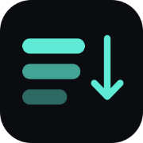

<div align="center">



# ScrollStack

**Headless, framework-agnostic infinite scrolling for TypeScript.**

[](https://www.npmjs.com/package/@scrollstackjs/core)
[](https://bundlejs.com/?q=%40scrollstackjs%2Fcore)
[](#quickstart)
[](./LICENSE)

[**Documentation**](https://devgauravjatt.github.io/scrollstackjs/) &nbsp;·&nbsp;
[**Live demo**](https://devgauravjatt.github.io/scrollstackjs/demo) &nbsp;·&nbsp;
[Examples](https://devgauravjatt.github.io/scrollstackjs/examples/) &nbsp;·&nbsp;
[Tutorial](https://devgauravjatt.github.io/scrollstackjs/tutorial) &nbsp;·&nbsp;
[API reference](https://devgauravjatt.github.io/scrollstackjs/api/core)

</div>

Headless, framework-agnostic infinite scrolling for TypeScript. All the logic —
pagination, retry, cancellation, the state machine, observers — lives in a tiny
core engine (**1.92 KB gzipped**). Framework adapters are thin bindings (React:
**0.32 KB**; Vue and Svelte comparably small). You bring the markup; ScrollStack
owns the behavior.

Think "the TanStack of scrolling": one core, many adapters.

> **Foundation build.** The core engine, **React, Vue, and Svelte** adapters, and the
> **virtual** and **devtools** packages are built, typed, and tested (**154 passing
> tests**) in a pnpm workspace on a current toolchain (TypeScript 7, Vitest 4,
> React 19, Vue 3, Svelte 5). Remaining adapters and feature packages are on the
> roadmap — see [`STATUS.md`](./STATUS.md).
> Design rationale is in [`DECISIONS.md`](./DECISIONS.md).

## Quickstart

**React**

```tsx
import { useInfiniteScroll } from '@scrollstackjs/react';

const { pages, ref, isFetchingNextPage, hasNextPage } = useInfiniteScroll({
  initialPageParam: 0,
  fetchPage: async ({ pageParam, signal }) =>
    (await fetch(`/api/items?cursor=${pageParam}`, { signal })).json(),
  getNextPageParam: (last) => last.nextCursor, // null = no more pages
});
// <li ref={ref}>{isFetchingNextPage ? 'Loading…' : ''}</li>
```

**Vue**

```vue
<script setup lang="ts">
import { useInfiniteScroll } from '@scrollstackjs/vue';
const { state, target } = useInfiniteScroll({
  initialPageParam: 0,
  fetchPage: async ({ pageParam, signal }) =>
    (await fetch(`/api/items?cursor=${pageParam}`, { signal })).json(),
  getNextPageParam: (last) => last.nextCursor,
});
</script>
<template>
  <li v-for="i in state.pages.flatMap((p) => p.items)" :key="i.id">{{ i.name }}</li>
  <div v-if="state.hasNextPage" :ref="target" />
</template>
```

**Svelte**

```svelte
<script lang="ts">
  import { onDestroy } from 'svelte';
  import { createInfiniteScroll } from '@scrollstackjs/svelte';
  const scroll = createInfiniteScroll({
    initialPageParam: 0,
    fetchPage: async ({ pageParam, signal }) =>
      (await fetch(`/api/items?cursor=${pageParam}`, { signal })).json(),
    getNextPageParam: (last) => last.nextCursor,
  });
  const { target } = scroll;
  onDestroy(scroll.destroy);
</script>

{#each $scroll.pages.flatMap(p => p.items) as i (i.id)}<li>{i.name}</li>{/each}
{#if $scroll.hasNextPage}<div use:target />{/if}
```

The sentinel element (`ref` / `:ref="target"` / `use:target`) auto-loads the next
page when it scrolls into view.

## Core (any framework)

```ts
import { createInfiniteScroll } from '@scrollstackjs/core';

const scroll = createInfiniteScroll({
  initialPageParam: 0,
  fetchPage: async ({ pageParam, signal }) => fetchPage(pageParam, signal),
  getNextPageParam: (last) => last.nextCursor,
});
scroll.subscribe(() => render(scroll.getSnapshot()));
scroll.observeTarget(sentinelElement); // or call scroll.loadNextPage() yourself
```

Snapshot: `{ status, fetchStatus, pages, pageParams, error, hasNextPage,
failureCount, isIdle, isLoading, isSuccess, isError, isFetching,
isFetchingNextPage }`. On a **load-more** failure the list stays visible
(`isSuccess` true) and `error` is set — see ADR-003.

## Pagination is one function

Cursor, offset, and page-number pagination are all just different
`getNextPageParam` implementations — not different APIs. Return `null`/`undefined`
to signal the end.

## Virtual lists

Past a few thousand rows, keeping every loaded page in the DOM is what makes a feed
stutter. [`@scrollstackjs/virtual`](./packages/virtual) renders only the rows on
screen — 50 out of 50,000 — with dynamic row measurement, window or container
scrolling, and SSR support. It is a **separate package** (ADR-001) and a second
store with the same contract as the engine, so the bindings are the same shape:

```tsx
import { useVirtualizer } from '@scrollstackjs/react/virtual';

const { items, totalSize, scrollRef, measureRef } = useVirtualizer({
  count: rows.length,
  estimateSize: () => 48, // a ballpark; rendered rows replace it with a measurement
});
```

A virtual list can't render the sentinel that normally triggers loading, so
`connectInfiniteScroll(virtualizer, engine)` watches the rendered window instead and
loads the next page as it nears the end. Guide:
[Virtual lists](https://devgauravjatt.github.io/scrollstackjs/guide/virtual-lists).

## Repository layout (pnpm workspace)

```
pnpm-workspace.yaml
packages/
  core/     @scrollstackjs/core     — the engine (35 tests)
  react/    @scrollstackjs/react    — useInfiniteScroll + /virtual (6 tests)
  vue/      @scrollstackjs/vue      — useInfiniteScroll + /virtual (8 tests)
  svelte/   @scrollstackjs/svelte   — createInfiniteScroll + /virtual (10 tests)
  virtual/  @scrollstackjs/virtual  — headless list virtualization (64 tests)
  devtools/ @scrollstackjs/devtools — dev-only inspector panel (31 tests)
examples/
  react-live-demo/              — all 7 features, Tailwind, real public APIs
  vue-live-demo/                — same seven, @scrollstackjs/vue
  svelte-live-demo/             — same seven, @scrollstackjs/svelte
  react-live-demo-with-devtool/ — the React demo with the devtools panel attached
docs/                           — VitePress site (guides + API reference)
CONTRIBUTING.md · DECISIONS.md · STATUS.md · AGENTS.md
```

Documentation is published to GitHub Pages by
[`.github/workflows/docs.yml`](.github/workflows/docs.yml) on every push to `main`
that touches `docs/` or `packages/`. It is live at
**[devgauravjatt.github.io/scrollstackjs](https://devgauravjatt.github.io/scrollstackjs/)**
and moves to `scrollstack.js.org` once the [js.org](https://github.com/js-org/js.org)
subdomain request is merged.

The docs site installs separately — it has its own `pnpm-workspace.yaml`, so a
VitePress upgrade can't perturb the library build:

```bash
cd docs && pnpm install && pnpm run dev   # http://localhost:5173
```

## Develop

```bash
pnpm install
pnpm run build       # build all packages (core first, topological)
pnpm test            # run all tests
pnpm run typecheck   # type-check all packages
pnpm run verify      # build + typecheck + test
```

Adapters resolve `@scrollstackjs/core` through the workspace (`workspace:^`), and
`pnpm -r` sequences the build so the core is compiled before anything depends on it.

## Contributing

Bug reports, docs fixes, and pull requests are welcome — see
[`CONTRIBUTING.md`](./CONTRIBUTING.md) for setup, the development loop, the
invariants the engine relies on, and the pull-request checklist. Open an issue
first for anything that changes behavior or the public API.

Looking for something to pick up? [`next-plan.md`](./next-plan.md) has the current
direction — scroll anchoring, chat lists, and a Solid adapter are next.

## License

MIT
